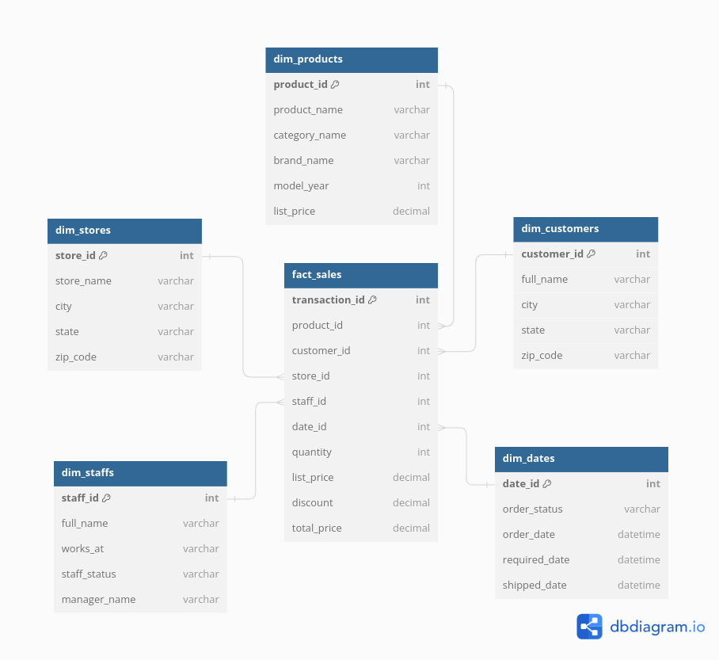

# Transform

In this section, we use dbt (data build tool) for transforming data. The dbt models folder (located in /dbt_project/) is the core of the transformaition process, it contains models that has the SQL logic for various transformations within our data warehouse (duckdb database in this case), such as joining tables, calculating derived columns, and aggregating data. These transformations are essential for preparing the data for analysis and visualization.

project structure:

```python
airflow_bikestore/
├── airflow/
│   ├── dags/
│   ├── logs/
│   ├── plugins/
│   ├── airflow-webserver-config.py
│   ├── airflow.cfg
│   ├── airflow.db
│   └── standalone_admin_password.txt
├── dbt_bikestore/
│   ├── analyses/
│   ├── logs/
│   ├── macros/
│   ├── models/
│   ├── seeds/
│   ├── snapshots/
│   ├── target/
│   ├── tests/
│   ├── .gitignore
│   ├── .user.yml
│   ├── dbt_project.yml
│   └── profiles.yml
└── README.md
```

In our profiles.yml for dbt-duckdb, We configure the connection to DuckDB by specifying the profile name and target, along with connection details. We use the type as duckdb, and define the path to our DuckDB database file, This configuration allows dbt to connect to our DuckDB database for running transformations and models.

The tables are denormalized and the relations are transformed into star-schema dimentions and fact table



